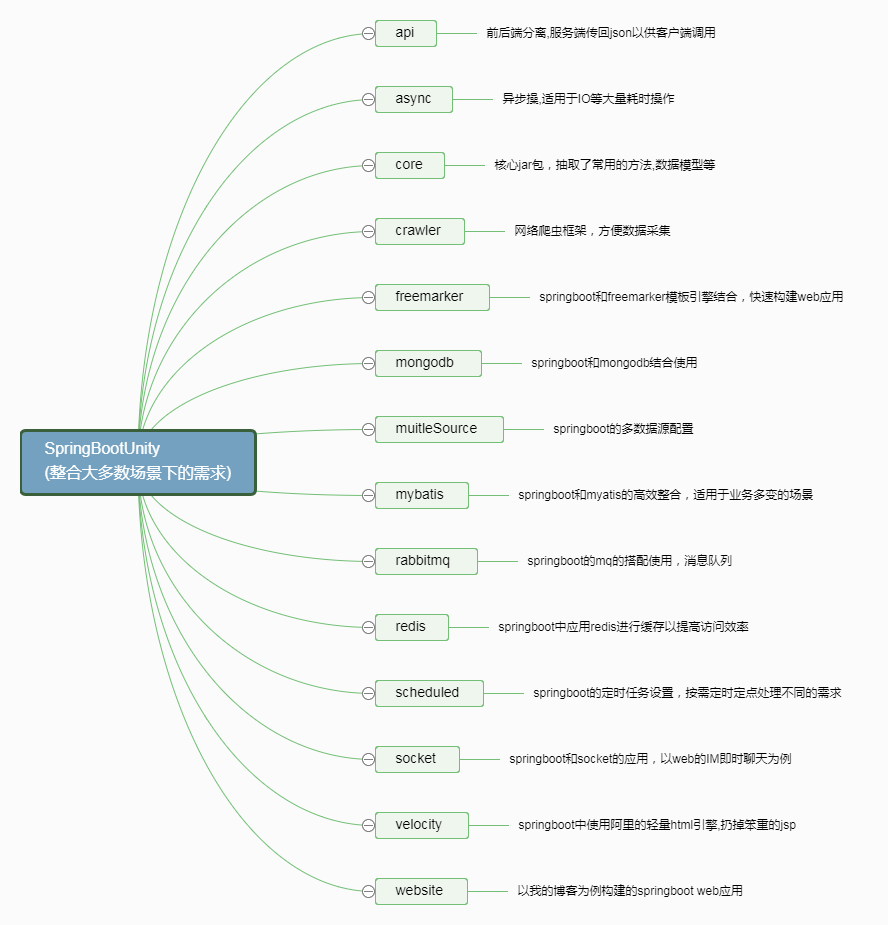
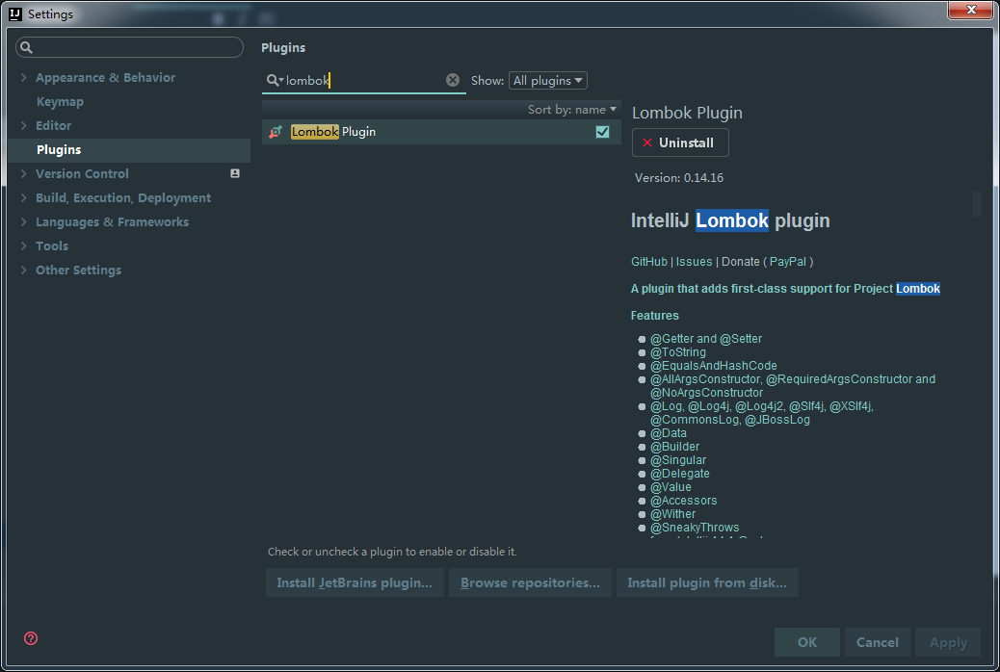
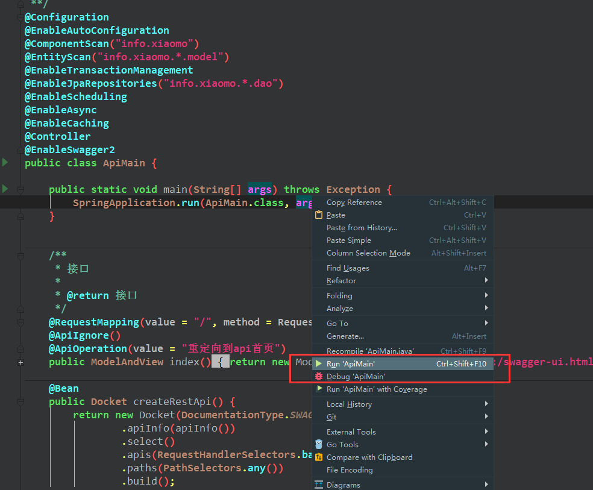

[](https://travis-ci.org/xiaomoinfo/SpringBootUnity)
[](#backers) [](#sponsors) [](https://github.com/xiaomoinfo/SpringBootUnity/issues)
[](https://raw.githubusercontent.com/xiaomoinfo/MysqlBlobToJsonTool/master/LICENSE)
[]()

###  项目简介


### 环境
- `maven` latest   
- `jdk1.8`   
- `spring boot 1.5.8 release`(目前最新版)
-  个人推荐`idea`来代替eclipse（希望不要被说成异教徒必须死）
- mysql5.5+
- git: 版本管理
- nginx: 反向代理服务器
- lombok


### 注意事项
- 本项目代码托管在[github](https://github.com/xiaomoinfo/SpringBootUnity)和[码云](http://git.oschina.net/hupeng/SpringBootUnity)两个地方,最新代码会先推送在github上,码云上会在github上更新完之后进行同步。
- 本项目多数数据库都用到了`hibernate`，如果没有提供`sql`文件。则启动时会根据代码映射自动生成数据库表，请在启动前修改`application.properties`中的数据库连接信息
- 本项目使用了`lombok`,在查看本项目时如果您没有下载`lombok 插件`，请先安装,不然找不到`get/set`方法。eclipse用户请参照[官网](http://jnb.ociweb.com/jnb/jnbJan2010.html#references)




### 启动方式

- 本地运行
本repo是一个多模块组成，每一个模块都可以单独打包运行。如果想运行哪个模块可以找到对应的Main文件右键运行。



- 在linux服务器运行
 `spring boot`内置了tomcat做为web容器，默认打成jar包直接放在服务器上执行就可以了
> `java -Xms64m -Xmx2048m -jar project.jar 5 >> ./project.log &`


### 打包
- 如果需要定制化打成war包，那么也很简单。在`maven`中做下设置就ok了,然后把war包扔到tomcat下面就可以运行了

```
    <modelVersion>4.0.0</modelVersion>
    <artifactId>api</artifactId>
    <packaging>war</packaging>
```


### 更新日志
- 2017-09-02 api模块: 添加swagger-bootstrap-ui,和原有ui并行存在。       
http://localhost:8080 默认UI           
http://localhost:808/doc.html bootstrap-ui  

- 2017-09-02 spring boot版本从1.4.3更新到1.5.8   
- 2017-09-02 修复不配置数据库信息无法启动的bug   
- 2017-09-02 版本号更新到2017.1   
- 2017-09-02 api模块(swagger)添加开源库swagger-bootstrap-ui，和swagger默认UI同时存在。  
- 2017-09-02 web模块添加数据库sql文件,导入后一键启动可直接访问到web界面。  
- 2017-09-06 mybatis模块:添加USER.sql,启动后访问:http://localhost:8080 即可看到接口数据
- 2017-09-06 所有模块： 添加 characterEncoding=utf8&useSSL=true 解决高版本mysql的sll警告
- 2017-09-06 添加代码贡献者列表和支持者，赞助商链接。
- 2017-09-08 crawler模块(网络爬虫):修复本地文件目录不存在会报错的bug。处理方式为：不存在则自动创建
- 2017-11-02 开源协议从apache更换到MIT
- 2017-11-02 添加本地运行方式的说明
- 2017-11-02 版本更新到2017.2
- 2017-11-02 spring boot版本更新到1.5.8


## 贡献者

感谢所有为本项目做出贡献的开发者们.
<a href="graphs/contributors"></a>


## 支持者

感谢您的支持! 🙏  [[成为支持者](https://opencollective.com/SpringBootUnity#backer)]

<a href="https://opencollective.com/SpringBootUnity#backers" target="_blank"></a>


## 赞助商

[[成为赞助商](https://opencollective.com/SpringBootUnity#sponsor)]支持本项目并成为赞助商. 您的LOGO和网站链接将会被展示在这里. 

<a href="https://opencollective.com/SpringBootUnity/sponsor/0/website" target="_blank"></a>
<a href="https://opencollective.com/SpringBootUnity/sponsor/1/website" target="_blank"></a>
<a href="https://opencollective.com/SpringBootUnity/sponsor/2/website" target="_blank"></a>
<a href="https://opencollective.com/SpringBootUnity/sponsor/3/website" target="_blank"></a>
<a href="https://opencollective.com/SpringBootUnity/sponsor/4/website" target="_blank"></a>
<a href="https://opencollective.com/SpringBootUnity/sponsor/5/website" target="_blank"></a>
<a href="https://opencollective.com/SpringBootUnity/sponsor/6/website" target="_blank"></a>
<a href="https://opencollective.com/SpringBootUnity/sponsor/7/website" target="_blank"></a>
<a href="https://opencollective.com/SpringBootUnity/sponsor/8/website" target="_blank"></a>
<a href="https://opencollective.com/SpringBootUnity/sponsor/9/website" target="_blank"></a>

###  项目说明
需求是多变的，本项目是以spring boot为基础，在使用spring boot的过程中对应不同的需求选用不同的技术和spring boot进行搭配，因此本项目是个偏于使用示例的定位。同时如果您在使用spring boot的过程中有什么好用的技术期待您对本项目的PR。

### 关于我
 @[小莫](https://xiaomo.info)：本人是一个热爱开源精神、追求新潮的开发者，技术过得去，还算勤勉！习惯以github的issue驱动方式来组织我的项目，也希望感兴趣的朋友和我联系，一起进步，共同开发感兴趣的开源项目。目前任rpg服务端主程，熟悉游戏开发和web开发。同时也是个喜欢二次元的死宅，爱动漫，略懂日语。

### 在线小工具

- [在线Cron表达式生成器](http://cron.qqe2.com/ "在线Cron表达式生成器")

- [在线工具 - 程序员的工具箱](http://tool.lu/ "在线工具 - 程序员的工具箱")


###  问题反馈
1. 欢迎提[issue](https://github.com/xiaomoinfo/SpringBootUnity/issues)一起完善这个项目。
2. QQ: 83387856
4. 个人主站: https://xiaomo.info

### 在线文档

- [JDK7英文文档](http://tool.oschina.net/apidocs/apidoc?api=jdk_7u4 "JDK7英文文档")

- [Spring4.x文档](http://spring.oschina.mopaas.com/ "Spring4.x文档")

- [Mybatis3官网](http://www.mybatis.org/mybatis-3/zh/index.html "Mybatis3官网")

- [Dubbo官网](http://dubbo.io/ "Dubbo官网")

- [Nginx中文文档](http://tool.oschina.net/apidocs/apidoc?api=nginx-zh "Nginx中文文档")

- [Freemarker在线手册](http://freemarker.foofun.cn/ "Freemarker在线中文手册")

- [Velocity在线手册](http://velocity.apache.org/engine/devel/developer-guide.html "Velocity在线手册")

- [Bootstrap在线手册](http://www.bootcss.com/ "Bootstrap在线手册")

- [Git官网中文文档](https://git-scm.com/book/zh/v2 "Git官网中文文档")

- [Thymeleaf](http://www.thymeleaf.org/doc/tutorials/3.0/thymeleafspring.html "Thymeleaf")


## [License](LICENSE "MIT")

    MIT License
    
    Copyright (c) 2017 Peng Hu
    
    Permission is hereby granted, free of charge, to any person obtaining a copy
    of this software and associated documentation files (the "Software"), to deal
    in the Software without restriction, including without limitation the rights
    to use, copy, modify, merge, publish, distribute, sublicense, and/or sell
    copies of the Software, and to permit persons to whom the Software is
    furnished to do so, subject to the following conditions:
    
    The above copyright notice and this permission notice shall be included in all
    copies or substantial portions of the Software.
    
    THE SOFTWARE IS PROVIDED "AS IS", WITHOUT WARRANTY OF ANY KIND, EXPRESS OR
    IMPLIED, INCLUDING BUT NOT LIMITED TO THE WARRANTIES OF MERCHANTABILITY,
    FITNESS FOR A PARTICULAR PURPOSE AND NONINFRINGEMENT. IN NO EVENT SHALL THE
    AUTHORS OR COPYRIGHT HOLDERS BE LIABLE FOR ANY CLAIM, DAMAGES OR OTHER
    LIABILITY, WHETHER IN AN ACTION OF CONTRACT, TORT OR OTHERWISE, ARISING FROM,
    OUT OF OR IN CONNECTION WITH THE SOFTWARE OR THE USE OR OTHER DEALINGS IN THE
    SOFTWARE.

