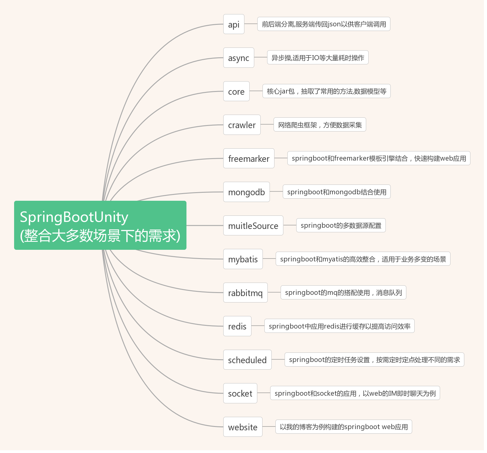
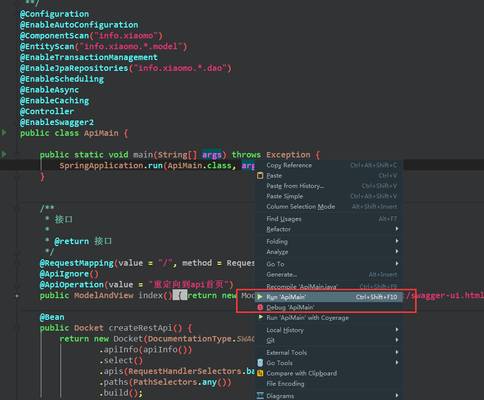
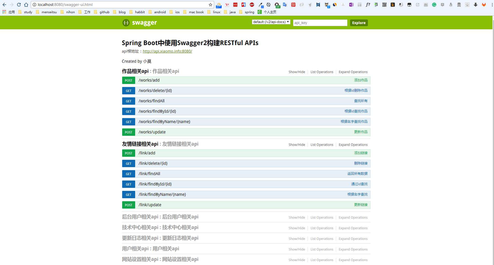

[](https://github.com/houko/SpringBootUnity/actions/workflows/build.yml)
[](https://github.com/houko/SpringBootUnity/actions/workflows/codeql-analysis.yml)
[](LICENSE)
[](https://spring.io/projects/spring-boot)
[](https://adoptium.net/)
[](https://github.com/houko/SpringBootUnity/issues)
[](#支持者) [](#赞助商)

# SpringBootUnity



## 项目简介

需求是多变的。本项目以 Spring Boot 为基础，针对不同需求把不同的技术和 Spring Boot 搭配起来，每一种搭配单独做成一个模块，因此它是一个偏使用示例的集合而非一个完整产品。

每个模块都能独立打包、独立启动，互不影响，可以只挑自己关心的那一个跑起来看。如果你在使用 Spring Boot 的过程中有什么好用的技术，欢迎提 PR。

## 模块一览

一共 30 个模块。`core` 是被其他模块共同依赖的基础包，其余每个模块各自演示一项技术。

| 模块 | 演示内容 | 启动类 | 需要的外部服务 |
| --- | --- | --- | --- |
| `core` | 公共基础包：工具类、基类、常量、异常、过滤器。被所有模块依赖，**不可独立运行** | — | — |
| `website` | 个人站点：JPA + FreeMarker 页面 + OpenAPI 接口，模块中最完整的一个 | `XiaomoMain` | MySQL、Redis |
| `javase` | Java SE 题库接口，JPA + OpenAPI 的典型增删改查 | `QuestionMain` | MySQL |
| `order` | 订单接口，含 zxing 二维码生成 | `OrderMain` | — |
| `mongodb` | MongoDB 文档数据库读写 | `MongodbMain` | MongoDB |
| `mybatis` | MyBatis 替代 JPA 作为持久层 | `MybatisMain` | MySQL |
| `multipleSource` | 多数据源配置与切换 | `MultipleSourceMain` | MySQL ×2 |
| `redis` | Redis 缓存读写与定时刷新 | `RedisMain` | Redis |
| `rabbitmq` | RabbitMQ 消息收发 | `RabbitMqMain` | RabbitMQ |
| `security` | Spring Security 表单登录与鉴权 | `SecurityMain` | — |
| `socket` | WebSocket 在线聊天，端口 **8081** | `ChatMain` | — |
| `scheduled` | `@Scheduled` 定时任务 | `ScheduledMain` | — |
| `async` | `@Async` 异步任务 | `AsyncMain` | — |
| `crawler` | jsoup 网络爬虫（阴阳师式神数据），抓取后落库 | `CrawlerMain` | MySQL |
| `freemarker` | FreeMarker 模板引擎 | `FreemarkerMain` | — |
| `thymeleaf` | Thymeleaf 模板引擎 | `ThymeleafMain` | — |
| `validation` | 参数校验（`@Valid` / `@Validated`）与 `@RestControllerAdvice` 全局异常处理 | `ValidationMain` | — |
| `fileupload` | 文件上传下载，含路径穿越防护 | `FileUploadMain` | — |
| `restclient` | 用 `RestClient` 调用外部 HTTP 服务 | `RestClientMain` | — |
| `cache` | Spring Cache 抽象 + Caffeine 本地缓存 | `CacheMain` | — |
| `actuator` | 健康检查、自定义 `HealthIndicator` 与业务指标 | `ActuatorMain` | — |
| `aop` | AOP 切面：自定义 `@Loggable` 注解记录耗时与调用次数 | `AopMain` | — |
| `httpinterface` | `@HttpExchange` 声明式 HTTP 客户端（代替 OpenFeign） | `HttpInterfaceMain` | — |
| `i18n` | 国际化：`MessageSource` + `LocaleResolver` 多语言文案 | `I18nMain` | — |
| `ratelimit` | 接口限流：`HandlerInterceptor` + 固定时间窗口 | `RateLimitMain` | — |
| `graphql` | GraphQL 查询接口（`@QueryMapping` + schema） | `GraphqlMain` | — |
| `kafka` | Kafka 消息收发（`KafkaTemplate` + `@KafkaListener`） | `KafkaMain` | Kafka |
| `mail` | 邮件发送（`SimpleMailMessage` / `MimeMessageHelper`） | `MailMain` | SMTP 服务器 |
| `elasticsearch` | Spring Data Elasticsearch 文档检索 | `ElasticsearchMain` | Elasticsearch |
| `flyway` | Flyway 数据库迁移 + `JdbcTemplate` 读取 | `FlywayMain` | MySQL |

除 `socket` 使用 8081 外，其余模块都监听 **8080**，所以一次只启动一个模块。

其中 `validation`、`fileupload`、`restclient`、`cache`、`actuator`、`async`、`aop`、`httpinterface`、`i18n`、`ratelimit`、`graphql`、`kafka`、`mail`、`flyway` 十四个模块附带可直接运行的测试。它们的测试都不依赖外部服务——`kafka` 用内嵌 Kafka、`mail` 用 GreenMail 内嵌 SMTP、`flyway` 用内嵌 H2，其余用 Spring 测试上下文；`mvn test` 即可跑通，也可以当作各自技术点的可执行文档来读。

## 技术栈

| 组件 | 版本 |
| --- | --- |
| Spring Boot | 4.1.1 |
| JDK | 21（编译目标；CI 同时在 21 和 25 上构建） |
| Maven | 3.9+ |
| Hibernate / Spring Data JPA | 7.x |
| Jackson | 3.x |
| API 文档 | springdoc-openapi 3.x（OpenAPI 3.1） |
| 数据库驱动 | MySQL Connector/J |
| 缓存 | Caffeine（`cache` 模块） |
| 监控 | Micrometer + Spring Boot Actuator（`actuator` 模块） |
| AOP | AspectJ（`aop` 模块） |
| GraphQL | Spring GraphQL + GraphQL Java（`graphql` 模块） |
| 消息 | Spring for Apache Kafka（`kafka` 模块） |
| 邮件 | Spring Mail + Jakarta Mail（`mail` 模块） |
| 搜索引擎 | Spring Data Elasticsearch（`elasticsearch` 模块） |
| 数据库迁移 | Flyway（`flyway` 模块） |
| 其他 | MyBatis、Lettuce（Redis）、jsoup、Apache POI、fastjson2、zxing |

Spring、Jackson、Hibernate、JUnit 等版本统一由 `spring-boot-dependencies` BOM 管理，不在本项目中单独指定。

## 环境要求

- JDK 21 或更高（Spring Boot 4 的最低要求是 17）
- Maven 3.9 或更高
- 按需准备对应模块的外部服务（见上表），只跑不需要外部服务的模块则无需任何准备

## 快速开始

构建全部模块：

```bash
mvn clean install
```

启动某一个模块，例如不依赖任何外部服务的 `order`：

```bash
java -jar order/target/order-2020.1.jar
```

也可以用 Maven 直接跑：

```bash
mvn spring-boot:run -pl order
```

在 IDE 中则找到对应模块的 `*Main` 类直接运行即可。

跑测试：

```bash
mvn test
```



部署到服务器时，Spring Boot 内置了 Tomcat，把打好的 jar 传上去执行就可以：

```bash
java -Xms64m -Xmx2048m -jar order-2020.1.jar >> ./order.log 2>&1 &
```

## API 文档

带有 OpenAPI 注解的模块（`website`、`javase`、`order`、`mongodb`）启动后可访问：

- Swagger UI：<http://localhost:8080/swagger-ui.html>
- OpenAPI 描述文档：<http://localhost:8080/v3/api-docs>



## 配置说明

每个模块的配置在各自的 `src/main/resources/config/application.properties`，日志配置在同目录的 `logback-dev.xml`。

需要注意：

- 涉及数据库的模块请先修改 `spring.datasource.*` 中的连接信息。多数模块使用 Hibernate 的 `ddl-auto=update`，在没有提供 sql 文件时会依据实体类映射自动建表。
- 仓库里的账号密码全部是占位符，**不要把真实凭据提交进版本库**。`core/src/main/resources/config/oauth.properties` 中的第三方登录密钥同理，请填入自己申请的值，或改为从环境变量注入。

## 打包成 war

如果需要部署到外部 Tomcat，在对应模块的 `pom.xml` 中改打包方式即可：

```xml
<packaging>war</packaging>
```

## 更新日志

完整记录见 [changeLog.md](changeLog.md)，以下为主要节点：

- **2026-09-09** 升级到 Spring Boot 4.1.1、JDK 21，全部依赖更新到最新版本；`javax.*` 迁移到 `jakarta.*`；API 文档从已停止维护的 springfox 迁移到 springdoc-openapi；security 模块改用 `SecurityFilterChain` 组件式配置；fastjson 迁移到 fastjson2，Jackson 升级到 3.x，POI 升级到 5.x；新增 GitHub Actions 构建 CI
- **2020-10-09** 升级到 Spring Boot 2.3.0、JDK 11，MySQL Connector 升级到 8
- **2018-04-09** 升级到 Spring Boot 2.0 release，API 有较大变动
- **2017-11-03** 合并 `api` 和 `website` 模块；按阿里巴巴编程规范 P3C 优化代码
- **2017-11-02** 开源协议从 Apache 更换为 MIT
- **2017-09-08** crawler 模块修复本地目录不存在时报错的问题

## 项目状态

本项目定位是示例集合，模块按需增删。欢迎通过 [issue](https://github.com/houko/SpringBootUnity/issues) 反馈问题或提出想看到的技术搭配。

本项目同时托管在 [GitHub](https://github.com/houko/SpringBootUnity) 和 [Gitee](https://gitee.com/hupeng_admin/SpringBootUnity)，以 GitHub 为准。

## 贡献者

感谢所有为本项目做出贡献的开发者们.

<a href="https://github.com/houko/SpringBootUnity/graphs/contributors"></a>

## 支持者

感谢您的支持! 🙏  [[成为支持者](https://opencollective.com/SpringBootUnity#backer)]

<a href="https://opencollective.com/SpringBootUnity#backers" target="_blank"></a>

## 赞助商

[[成为赞助商](https://opencollective.com/SpringBootUnity#sponsor)]支持本项目并成为赞助商. 您的 LOGO 和网站链接将会被展示在这里.

<a href="https://opencollective.com/SpringBootUnity/sponsor/0/website" target="_blank"></a>
<a href="https://opencollective.com/SpringBootUnity/sponsor/1/website" target="_blank"></a>
<a href="https://opencollective.com/SpringBootUnity/sponsor/2/website" target="_blank"></a>
<a href="https://opencollective.com/SpringBootUnity/sponsor/3/website" target="_blank"></a>
<a href="https://opencollective.com/SpringBootUnity/sponsor/4/website" target="_blank"></a>
<a href="https://opencollective.com/SpringBootUnity/sponsor/5/website" target="_blank"></a>
<a href="https://opencollective.com/SpringBootUnity/sponsor/6/website" target="_blank"></a>
<a href="https://opencollective.com/SpringBootUnity/sponsor/7/website" target="_blank"></a>
<a href="https://opencollective.com/SpringBootUnity/sponsor/8/website" target="_blank"></a>
<a href="https://opencollective.com/SpringBootUnity/sponsor/9/website" target="_blank"></a>

## 关于我

@[小莫](https://xiaomo.info)：热爱开源、追求新潮的开发者，习惯以 GitHub 的 issue 驱动方式组织自己的项目。熟悉游戏开发和 Web 开发，目前任 RPG 服务端主程。也是个喜欢二次元的死宅，爱动漫，略懂日语。

欢迎联系一起进步：

- Issue：<https://github.com/houko/SpringBootUnity/issues>
- 个人主站：<https://xiaomo.info>
- QQ：83387856

## 相关链接

- [Spring Boot 官方脚手架](https://start.spring.io/)
- [Spring Boot 官方文档](https://docs.spring.io/spring-boot/index.html)
- [在线 Cron 表达式生成器](https://cron.qqe2.com/)

## License

[MIT](LICENSE) © Peng Hu
