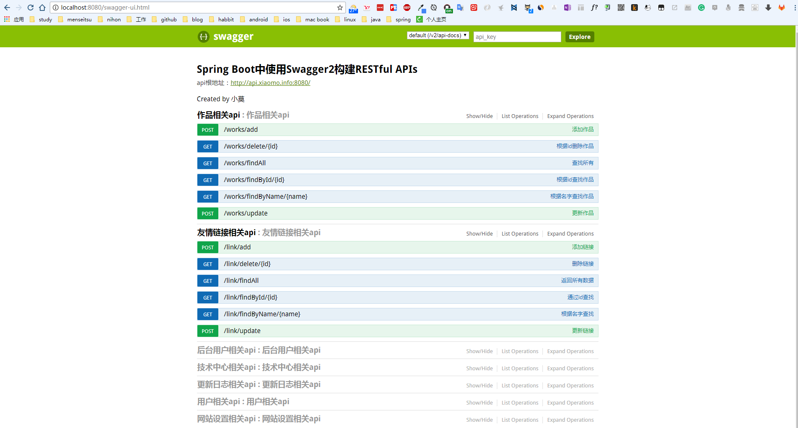
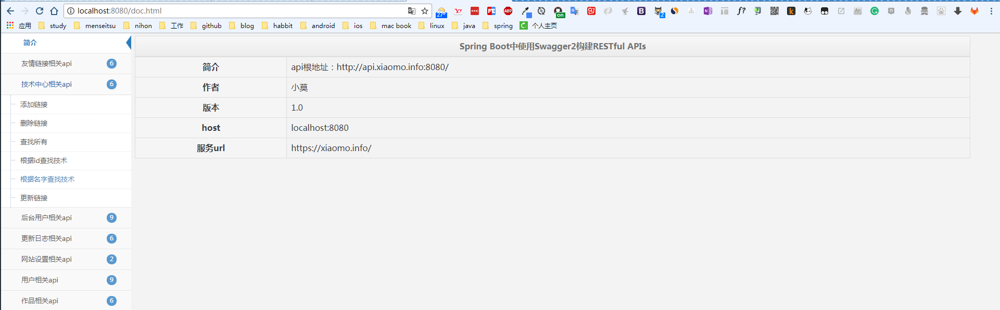
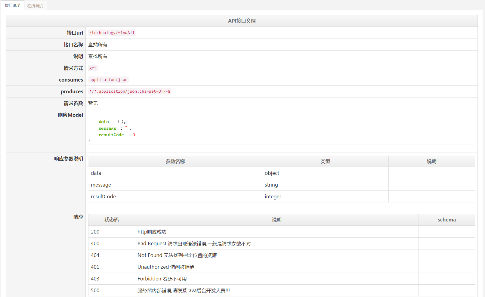
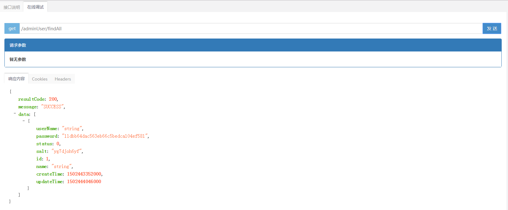
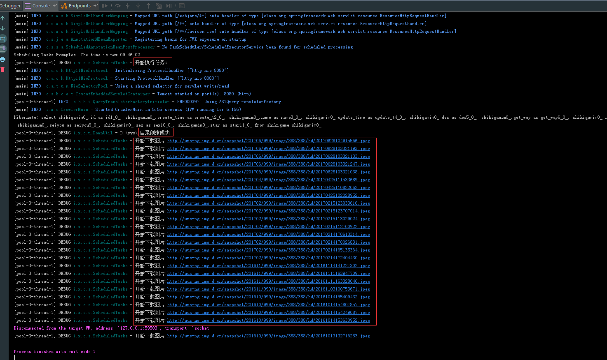
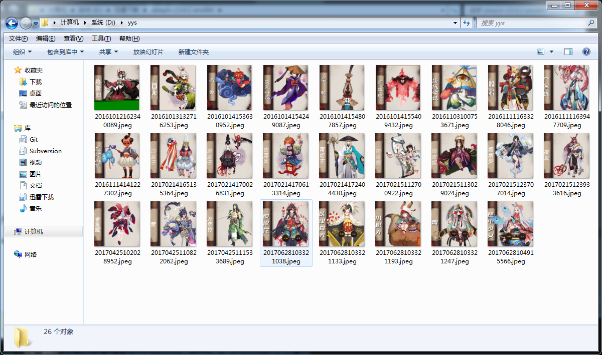

- 2017-09-02 api模块: 添加swagger-bootstrap-ui,和原有ui并行存在。       
http://localhost:8080 默认UI           
http://localhost:808/doc.html bootstrap-ui   

```
1. spring boot版本从1.4.3更新到1.5.6   
2. 修复不配置数据库信息无法启动的bug   
3. 版本号更新到2017.1   
4. api模块(swagger)添加开源库swagger-bootstrap-ui，和swagger默认UI同时存在。  
5. web模块添加数据库sql文件,导入后一键启动可直接访问到web界面。  
```


#### swagger            



#### bootstrap-ui







- 2017-09-06 更新记录

```
1. mybatis模块:添加USER.sql,启动后访问:http://localhost:8080 即可看到接口数据
2. 所有模块： 添加 characterEncoding=utf8&useSSL=true 解决高版本mysql的sll警告
3. 添加代码贡献者列表和支持者，赞助商链接。
```

- 2017-09-08 更新记录

```
1. crawler模块(网络爬虫):修复本地文件目录不存在会报错的bug。处理方式为：不存在则自动创建
```


