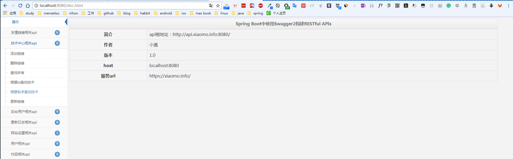
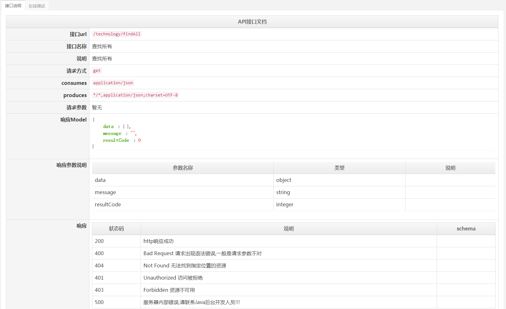
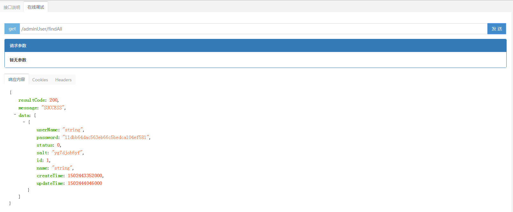
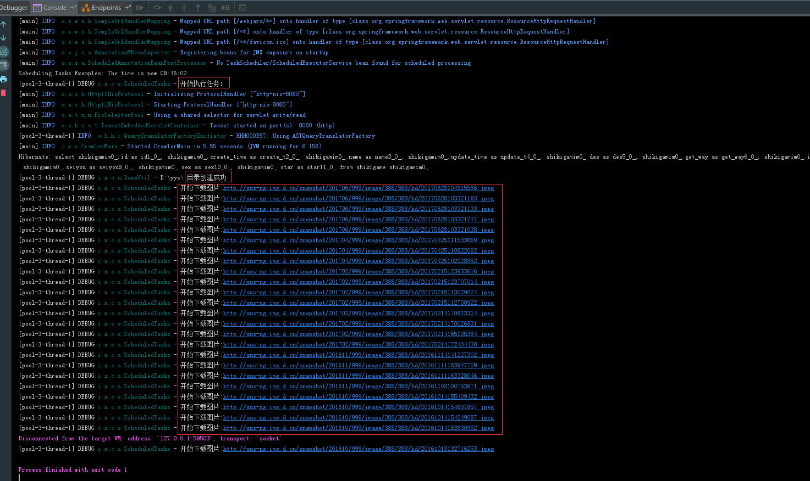

- 2017-09-02 api模块: 添加swagger-bootstrap-ui,和原有ui并行存在。       
http://localhost:8080 默认UI           
http://localhost:8080/doc.html bootstrap-ui   

```
1. spring boot版本从1.4.3更新到1.5.6   
2. 修复不配置数据库信息无法启动的bug   
3. 版本号更新到2017.1   
4. api模块(swagger)添加开源库swagger-bootstrap-ui，和swagger默认UI同时存在。  
5. web模块添加数据库sql文件,导入后一键启动可直接访问到web界面。  
```


#### swagger            


#### bootstrap-ui







- 2017-09-06 更新记录

```
1. mybatis模块:添加USER.sql,启动后访问:http://localhost:8080 即可看到接口数据
2. 所有模块： 添加 characterEncoding=utf8&useSSL=true 解决高版本mysql的sll警告
3. 添加代码贡献者列表和支持者，赞助商链接。
```

- 2017-09-08 更新记录

```
1. crawler模块(网络爬虫):修复本地文件目录不存在会报错的bug。处理方式为：不存在则自动创建
```



- 2026-09-09 更新记录

```
1. 升级到 spring boot 4.1.1, jdk 升级到 21, 全部依赖更新到最新版本
2. javax.* 迁移到 jakarta.*(persistence/servlet/mail/websocket)
3. api 文档从已停止维护的 springfox 迁移到 springdoc-openapi, 注解升级到 OpenAPI 3
4. 移除 swagger-bootstrap-ui / knife4j(最新版仍锁定 spring boot 3, 无法与 4 共存),
   上文提到的 /doc.html 界面不再提供, 改用 springdoc 自带的 /swagger-ui.html
5. security 模块改用 SecurityFilterChain 组件式配置, 替换已移除的 WebSecurityConfigurerAdapter
6. fastjson 迁移到 fastjson2, jackson 升级到 3.x, poi 升级到 5.x, dom4j 迁移到 org.dom4j
7. 新增 GitHub Actions 构建 CI(此前仓库没有任何会编译代码的 CI)
8. 修正包名拼写: info.xiaomo.anysc -> async, info.xiaomo.core.untils -> utils
9. 打开此前被全局关闭的测试执行(surefire skipTests)
10. 清理 oauth.properties 中提交进仓库的第三方登录密钥, 换成占位符
```

- 2026-09-09 新增示例与既有示例改进

```
1. 新增 validation 模块: @Valid / @Validated 参数校验 + @RestControllerAdvice 全局异常处理
2. 新增 fileupload 模块: 单文件/多文件上传与下载, 含路径穿越防护
3. 新增 restclient 模块: 用 spring 6.1 引入的 RestClient 调用外部 HTTP 服务
4. 新增 cache 模块: spring cache 抽象 + caffeine 本地缓存
5. 新增 actuator 模块: 健康检查, 自定义 HealthIndicator 与 micrometer 业务指标
6. 以上五个模块均不依赖外部服务, 且各自带可运行的测试
7. 重写 async 模块: 去掉 90 行 return null 的空实现, 改用 CompletableFuture,
   移除自旋等待, AsyncResult(已废弃)换成 CompletableFuture.completedFuture
8. 修复 -parameters 编译标志缺失导致的运行时故障(详见下)
9. 修正多个启动类中复制粘贴的 javadoc(非 rabbitmq 模块却写着"RabbitMq启动器")
```

其中第 8 点是一个仅在运行时才会暴露的问题: spring framework 6.1 移除了从调试符号推断参数名的
LocalVariableTableParameterNameDiscoverer, 因此未显式命名的 @PathVariable / @RequestParam
在 spring boot 4 下会直接抛 IllegalArgumentException。项目中共有 40 处这样的写法,
编译期没有任何提示。spring-boot-starter-parent 默认会加 -parameters, 但本项目是导入 BOM
而非继承 parent, 需要在 maven-compiler-plugin 中自行配置。

- 2026-09-09 修复 CodeQL 报出的安全问题

```
1. HttpUtil: 移除"接受任何证书"的 TrustManager 和"永远返回 true"的 HostnameVerifier,
   TLS 证书链与主机名校验交回 JDK 默认实现
2. HttpUtil.setCookie: 补上 secure 与 SameSite=Lax
3. FileUtil: 上传文件名先过滤路径字符, 落盘路径用 normalize + startsWith 限制在 upload 目录内
4. RandomUtil: token / 密码 / 盐值改用 RandomStringUtils.secure()(SecureRandom 支撑),
   原先的 java.util.Random 种子只有 48 位且算法公开, 可预测
5. 新增 SecurityHardeningTest 覆盖以上各项, 防止改回去
```

第 1 条是行为变更: 之前连接任何 https 站点都不校验证书, 现在会。如果有服务端用的是自签名或过期证书, 升级后会连接失败 —— 这正是该被暴露出来的问题, 正确的做法是把该证书加进信任库, 而不是关掉校验。
